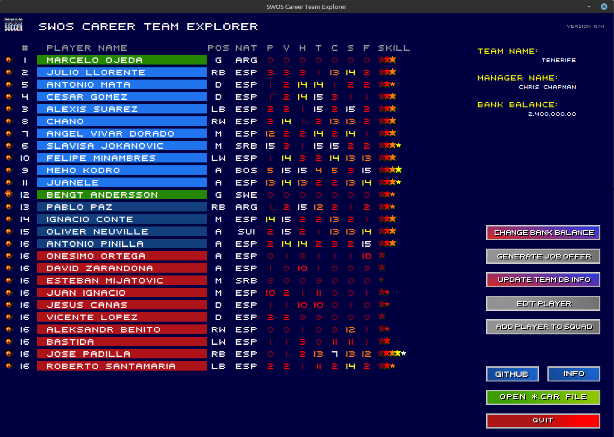

# Sensible Soccer career team explorer



This is a simple and dirty Python app to extract squad info from ***CAR*** file for the purpose of getting details on TRIAL and RES players.
I'm not quite sure it's cheating. Let's just say you've got a very good scout in the team who gives you feedback on hot-prospects. :smile:

I've build this tool to have a quick access to squad details. Probably will improve it in future.
This tool may have some bugs. Any feedback is always appreciated.

### Requirements

* Python >=3.10
* Additional Python's libs: **tk** (tkinter) and **ImageTk** (may be a separate package), **pillow** (PIL), **xml.dom** (minidom)  
  If you miss any Python libs please use your repo or *pip install* or if you're on Windows you probably need to handle this via web browser and install manually.
* *swos.ttf* font installed (otherwise it'll display other font)

### Running

Please make sure you've got your paths setup correctly under *CARexplorer.conf* file. Make sure you use **absolute paths**.

Once this is done just type in console (or from command line):

```
python CARexplorer.py
```

If your system is configured the proper way you may also want to double click on *CARexplorer.py* to execute the app.